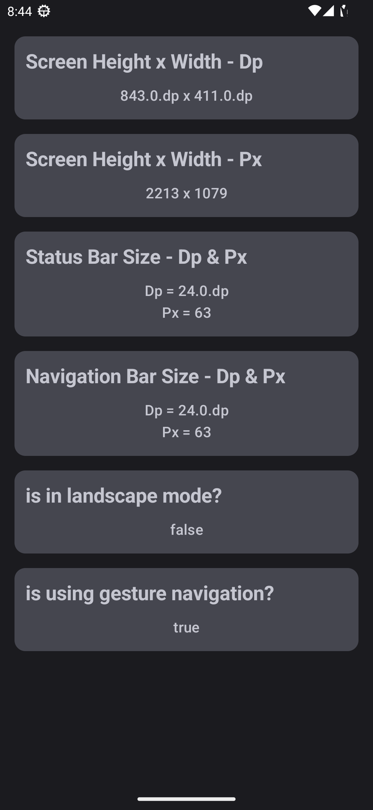
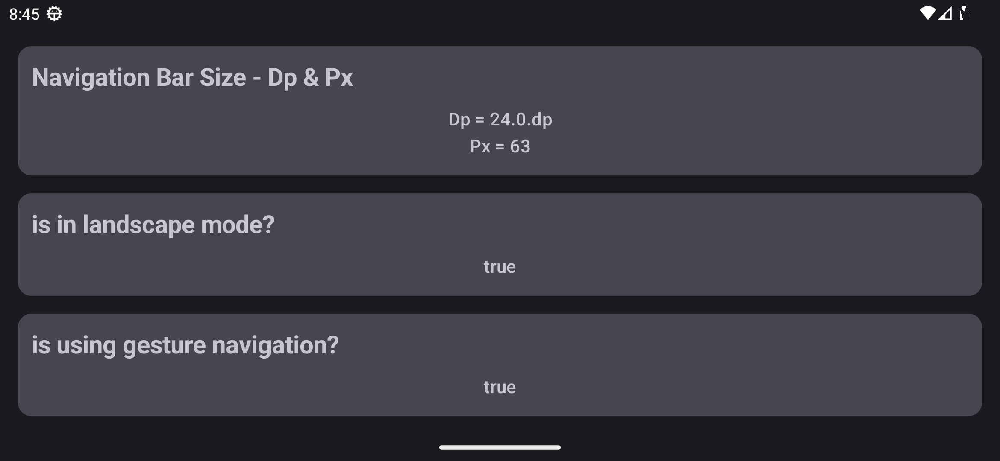

# Window Utils 


Window Utils contains many useful composable functions to provide useful window info like
screen dimensions and system bar size in `Dp` and `Px` and more 

You can learn more about Dimensions [here](https://developer.android.com/guide/topics/resources/more-resources#Dimension)

- [ScreenDimensions](https://github.com/MadFlasheroo7/Madifiers/blob/Main/madifiers-window/windowUtils/src/main/java/pro/jayeshseth/windowUtils/WindowInfo.kt#L34)
- [StatusBars](https://github.com/MadFlasheroo7/Madifiers/blob/Main/madifiers-window/windowUtils/src/main/java/pro/jayeshseth/windowUtils/WindowInfo.kt#L53)
- [NavigationBar](https://github.com/MadFlasheroo7/Madifiers/blob/Main/madifiers-window/windowUtils/src/main/java/pro/jayeshseth/windowUtils/WindowInfo.kt#L65)
- [isGestureNavigation](https://github.com/MadFlasheroo7/Madifiers/blob/Main/madifiers-window/windowUtils/src/main/java/pro/jayeshseth/windowUtils/WindowInfo.kt#L77)
- [isInLandscapeMode](https://github.com/MadFlasheroo7/Madifiers/blob/Main/madifiers-window/windowUtils/src/main/java/pro/jayeshseth/windowUtils/WindowInfo.kt#L87)

# Setup
add maven central repo to your root `settings.gradle.kts`
```kotlin
dependencyResolutionManagement {
    repositoriesMode.set(RepositoriesMode.FAIL_ON_PROJECT_REPOS)
    repositories {
        google()
        mavenCentral()
    }
}
```
add the dependency to your module's `build.gradle.kts`
```kotlin
dependencies {
    implementation("pro.jayeshseth.madifiers:windowUtils:<version>")
}
```

# Screen Dimensions
**ScreenDimensions** returns the screen height and width in `Dp` and `Px`

# Status Bars
**Status Bars** returns the status bar height in `Dp` and `Px`
``` kotlin
val statusBarSize = WindowInsets.systemBars.asPaddingValues().calculateTopPadding()
```
```
+----------------+
|   Top          |
|   Padding      |
+----------------+
|                |
|     Content    |
|                |
+----------------+
```

# Navigation Bar
**NavigationBar** returns the navigation bar height in `Dp` and `Px`
```kotlin
val navigationBarSize = WindowInsets.systemBars.asPaddingValues().calculateBottomPadding()
```
```
+----------------+
|                |
|     Content    |
|                |
+----------------+
|   Bottom       |
|   Padding      |
+----------------+
```

# isGestureNavigation
**isGestureNavigation** is a hacky way to check if device is using gesture navigation bar or 
3 button nav bar
> Note: Doesn't work for tablet or foldable devices

# isInLandscapeMode
**isInLandscapeMode** checks if device is in landscape orientation

# Screenshots
| Portrait                                 | landscape                                           |
|------------------------------------------|-----------------------------------------------------|
|  |  |

Check Out Working Sample [here](../../app/src/main/java/pro/jayeshseth/madifiers/ui/screens/WindowInfo.kt)